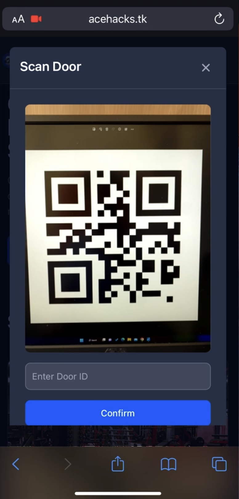

# Autonomous Cloud-based Exchange (ACE) for Physical Subscriptions

<div align="center">
	<a href="https://github.com/JonathanBastineKho/cloud-based-physical-subscription">
	
	</a>
	<h3 align="center">
	<strong>ACE Physical Subscription</strong>
	</h3>
	<p align="center">
		An Autonomous Cloud-based Exchange for physical-based subscriptions utilizing the Phonepass API for the physical access authorization mechanism and STEPPAY API for the subscription and payment gateway management.
	</p>
</div>

<br>

## Authors
<hr>

- [@JonathanBastineKho (Jonathan Bastine Kho)](https://www.github.com/jonathanbastinekho)
- [@edbertekaputera (Edbert Ekaputera)](https://www.github.com/edbertekaputera)
- [@iAmKarly (Carlos Vincent Frasenda)](https://www.github.com/iamkarly)

<br>

## Acknowledgements
<hr>
 
 - [APPETIZER HACKATHON 2022](https://www.api-appetizer.com)
 - [ONE FIRST (PHONEPASS API)](http://onefirst.co.kr)
 - [STEPPAY](https://www.steppay.kr)

<br>

## Background
<hr>
<p style='text-align: justify;'>&nbsp;&nbsp;&nbsp;&nbsp;In the era of new normal, there exists a sudden flow of human traffic as they begin exploring the physical spaces and activities that were previously restricted by the COVID-19 virus. 
Though, lingering thoughts of limiting physical contact still remain within the minds of the public. As such, the utilization of the PHONEPASS and STEPPAY API allows for simple access of common physical subscription-based spaces with decreased physical contact.
</p>
<br>

## Sample
<hr>





<br>

## System architecture
<hr>

The system relies on the communication between [PHONEPASS](http://onefirst.co.kr), our DATABASE, and [STEPPAY](https://www.steppay.kr), where the `STEPPAY API`  is utilized for the Payment Gateway and Subscription Management. And the `PHONEPASS API` for access authentication and authorization.


### Marketplace: Door Listing


### Marketplace: Subscription Order


### Door Access

<br>

## Database Architecture
<hr>

The system implements an object-relational database.

### Conceptual Model

### Relational Model
```
Company(username, email, password, address, phonepassId, phonepassPw)
Primary key = (username)
Candidate key = (email)

User(username, email, customerId, password, phoneNumber)
Primary key = (username)
Candidate key 1 = (email)
Candidate key 2 = (customerId)

Door(steppayID, steppayCode, doorName, serialNumber, category, description, companyUsername
     price, priceCode, interval, imageUrl, postingStatus)
Primary key = (serialNumber)
Candidate key 1 = (steppayID)
Candidate key 2 = (steppayCode)
Foreign key = (companyUsername) REFERENCES Company (username)

Sale(saleId, value, date, companyUsername, serialNumber)
Primary key = (saleId)
Foreign key 1 = (companyUsername) REFERENCES Company (username)
Foreign key 2 = (serialNumber) REFERENCES Door (serialNumber)

Key(keyId, startTime, endTime, duration, serialNumber, userUsername)
Primary key = (keyId)
Foreign key 1 = (serialNumber) REFERENCES Door (serialNumber)
Foreign key 2 = (userUsername) REFERENCES User (username)
```
<br>

## Tech Stack

**Frontend:** HTML/CSS/JavaScript, TailwindCSS, JQuery, Chart.js, Flowbite

**Backend:** Flask, requests, SQLAlchemy

**Database:** PostgreSQL
<br>
<br>


## Getting started
<hr>

### **Environment Variables**
To run this project, you will need to add the following environment variables to your .env file.

`DATABASE_URL` : Database url.

`SECRET_KEY` : Flask Secret Key.

`STEPPAY_SECRET_KEY` : STEPPAY API Secret Key.

`RSA_PUBLIC_KEY` : Relative path for 'publickey.pem' file.

`RSA_PRIVATE_KEY` : Relative path for 'privatekey.pem' file.

If hosted locally:

- `UPLOAD_FOLDER` : Relative path for uploads folder.

If hosted on cloud (For this project, we hosted on google cloud)

- `GOOGLE_APPLICATION_CREDENTIALS` : Relative path for Google Service Account Credential JSON.

- `BUCKET_NAME` : Name of bucket.

<br>

### **Installation**

1. Clone the project
```bash
git clone https://github.com/JonathanBastineKho/cloud-based-physical-subscription
```
2. Install npm packages
```bash
npm install -D tailwindcss
```

3. Initialize Tailwind CSS compiler
```bash
# Default method
npx tailwindcss -i ./static/src/input.css -o ./static/dist/css/output.css --watch

# Or you can simply run the script
init_npx.bat # For windows (cmd/powershell)
sh init_npx.sh # For Mac/Linux (terminal)
```

4. Install python libraries with pip.
```bash
pip install -r requirements.txt
```

<br>

### **Local Deployment**

1. Run application.py
```bash
python3 application.py
```

<br>

## License
<hr>

Distributed under the MIT License. See [License](./LICENSE) for more information.
